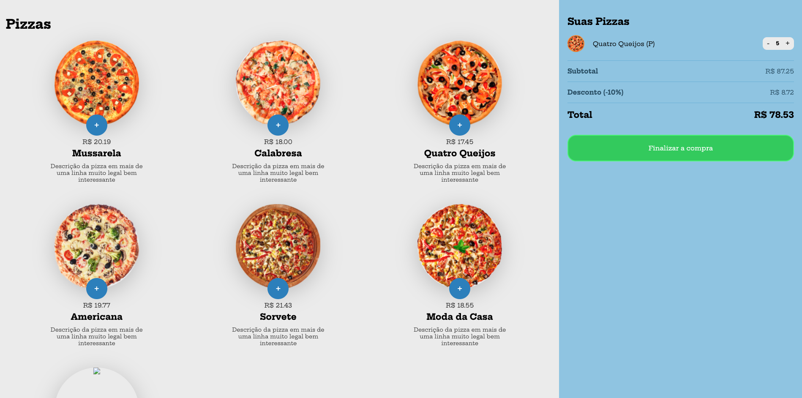

# Shopping Cart Project

## Projeto feito em aula. Carrinho de compras de uma pizzaria.

### Technologys:
  

### Features:
- [x] Adicionar e Remover pordutos do carrinho;
- [x] Mostrar carrinho de compras;
- [x] Selecionar tamanho do produto;
- [x] Selecionar quantidade do produto;
- [x] Aplicação de desconto;

### Status: 
#### :rocket: Finalizado!

### Author:

 <a href="https://www.linkedin.com/in/bruno-reis-9a937b189/">
  
   
  <b>Bruno Reis :rocket:</b>
 </a>

